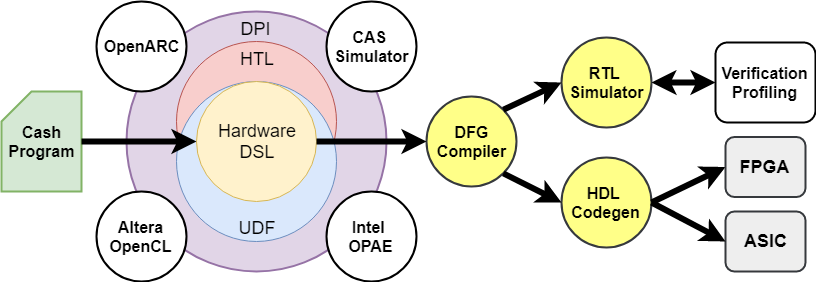

# What's Cash?

Cash is a C++ embedded domain specific library (EDSL) for hardware design and simulation. 
It uses template metaprogramming and macro-based reflection to extend the C++ language with hardware specific constructs. 
Cash enables developpers to describe and simulate their hardware designs in a single source program, leveraging the large ecosystem of C++ development tools and libraries.

<figure>
  
  <figcaption style="text-align:center;font-weight:bold">The Cash Framework Overview.</figcaption>
</figure>

# Requirements

Cash requires a C++17 compiler to build and works best with clang 9 to leverage its custom plugin for code reflection.

Other dependencies include:

  - [LLVM](https://www.llvm.org)
  - [LIBJIT](https://www.gnu.org/software/libjit)
  - [iVerilog](http://iverilog.icarus.com)
  - [Catch](https://github.com/catchorg/Catch2)

# Build Status

[](https://travis-ci.org/gtcasl/cash) 
[](http://codecov.io/github/gtcasl/cash?branch=master)

# System Setup

**Minimal System Requirement: Ubuntu 18.04 (Bionic)**

Install Build Essentials:
```shell    
$ sudo apt-get install build-essential git cmake zlib1g-dev
```    
Install IVerilog:
```shell
$ sudo apt-get install iverilog
```    
Install LLVM 9:
```shell
$ sudo apt-get install clang-9 libclang-9-dev
$ sudo update-alternatives --install /usr/bin/clang++ clang++ /usr/bin/clang++-9 100
$ sudo update-alternatives --install /usr/bin/clang clang /usr/bin/clang-9 100
```
# Installation

To install Cash you must clone the repository and create a build directory:
```shell
$ git clone https://github.com/gtcasl/cash.git && cd cash
$ mkdir build && cd build
```
Then use run cmake to generate the makefile and export the package informations:
```shell
$ cmake ..
```
Build and install Cash on your system:
```shell
$ make -j`nproc` all
$ sudo make install
```
Test your build
```shell
$ make test
```

**Alternative Installation using LIBJIT Compiler**

Install LIBJIT dependencies:
```shell  
$ sudo apt-get install libtool autoconf flex bison texinfo
```  
Build and install LIBJIT:
```shell  
$ git clone https://git.savannah.gnu.org/git/libjit.git  
$ pushd libjit
$ ./bootstrap
$ mkdir build
$ pushd build
$ ../configure --with-pic
$ make -j`nproc` all
$ sudo make install
$ popd
$ popd
```  
Build and install Cash using 'JIT=LIBJIT' configuration option:
```shell  
$ mkdir build && cd build
$ cmake .. -DJIT=LIBJIT
$ make -j`nproc` all
$ sudo make install
```
# QuickStart Example

#### Implementing a Generic Matrix Multiply hardware using a systolic array of MAC units as illustrated in the block diagram below.


1. Create demo folder
```shell
$ mkdir demo
$ cd demo
```
2. Copy Makefile template
```shell
$ cp /path_to_project/scripts/Makefile .
```
3. Create a file 'demo.cpp' that contains the code listing below.

```cash
#include <cash/core.h>
#include <cash/htl/counter.h>
#include <assert.h>
#include <iostream>

using namespace ch::core;
using namespace ch::htl;

// Generic MAC module
template <uint I, uint O>
struct MAC {
  __io (
    __in  (ch_bool)   enable,
    __in  (ch_int<I>) a_in,
    __in  (ch_int<I>) b_in,
    __out (ch_int<I>) a_out,
    __out (ch_int<I>) b_out,
    __out (ch_int<O>) c_out
  );

  void describe() {
    io.a_out = ch_nextEn(io.a_in, io.enable, 0);
    io.b_out = ch_nextEn(io.b_in, io.enable, 0);
    io.c_out = ch_nextEn(io.c_out + ch_mul<O>(io.a_in, io.b_in), io.enable, 0);
  }
};

// Generic MatMul module
template <unsigned I, unsigned O, unsigned N, unsigned P, unsigned M>
struct MatMul {
  __io (
    __in  (ch_bool)                         valid_in,
    __in  (ch_vec<ch_int<I>, N>)            a_in,
    __in  (ch_vec<ch_int<I>, P>)            b_in,
    __out (ch_vec<ch_vec<ch_int<O>, P>, N>) c_out,
    __out (ch_bool)                         valid_out
  );

  void describe() {
    // systolic 2D array of MAC units
    ch_vec<ch_vec<ch_module<MAC<I, O>>, P>, N> macs;

    // using counter object from HTL library
    ch_counter<N+P+M> ctr(io.valid_in);

    // MAC array connections
    for (unsigned r = 0; r < N; ++r) {
      auto p = ch_delayEn(io.a_in[r], io.valid_in, r, 0);
      for (unsigned c = 0; c < P; ++c) {
        auto q = ch_delayEn(io.b_in[c], io.valid_in, c, 0);
        macs[r][c].io.enable = io.valid_in;
        macs[r][c].io.a_in = c ? macs[r][c-1].io.a_out.as_int() : p;
        macs[r][c].io.b_in = r ? macs[r-1][c].io.b_out.as_int() : q;        
        io.c_out[r][c] = macs[r][c].io.c_out;
      }
    }

    // output valid?
    io.valid_out = ch_nextEn(ctr.value() == N+P+M-1, io.valid_in, false);
  }
};

static constexpr int InBits = 8;
static constexpr int OutBits = 24;
static constexpr int N = 2;
static constexpr int P = 3;
static constexpr int M = 4;

int main() {

  // a=MxN, b=PxM, c=PxN
  int a[N][M] = { { 0, 1, 2, 3 }, { 4, 5, 6, 7 } };
  int b[M][P] = { { 0, 1, 2 }, { 3, 4, 5 }, { 6, 7, 8 }, { 9, 10, 11 } };
  int c[N][P] = { { 42, 48, 54 }, { 114, 136, 158 } };

  ch_device<MatMul<InBits, OutBits, N, P, M>> matmul;

  ch_tracer tracer(matmul);
  tracer.run([&](ch_tick t)->bool {
    matmul.io.valid_in = true;
    auto j = t / 2;
    for (size_t i = 0; i < N; ++i) {
      matmul.io.a_in[i] = (j < M) ? a[i][j] : 0;
    }
    for (size_t i = 0; i < P; ++i) {
      matmul.io.b_in[i] = (j < M) ? b[j][i] : 0;
    }
    return !matmul.io.valid_out;
  }, 2);

  std::cout << "result = " << matmul.io.c_out << std::endl;

  // Verify  
  for (size_t j = 0; j < N; ++j)  {
    for (size_t i = 0; i < P; ++i) {
      assert(c[j][i] == matmul.io.c_out[j][i]);
    }
  }

  ch_toVerilog("matmul.v", matmul);
  tracer.toVCD("matmul.vcd");

  return 0;
}
```

4. Build the program
```shell
    $ make
```
5. Run the program
```shell
    $ demo.out
```
# Documentation

### Module Class

The top-level description of a hardware block in Cash is a module, described using a C++ *struct* or *class*.
A valid Cash module should define at least two properties:
- A *__io()* public member describing the module inputs and outputs interfaces.
- A *describe()* public method providing the code description of the hardware logic. 

Cash modules can be extended like any other C++ class using inheritance or polymorphism. 
Likewise, class methods or functions can also be defined to improve abstraction and code reuse.

Our QuickStart example above describes a *'MatMul'* top module that consumes a 2D array of *'MAC'* sub-modules.
The 'MatMul' top module is instantiated in the host *'main()'* routine using the 'ch_device\<T\>' transfrom.
The 'MAC' sub-module are instantiated inside the top module using the 'ch_module\<T\>' transform.

### Data Types

<table>
    <tr style="font-weight:bold;background-color:#f5f2f0">
        <td>Category</td>
        <td>Description</td>
    </tr>
    <tr>
        <td>Primary Types</td>
        <td>ch_bit, ch_int, ch_uint, ch_bool</td>
    </tr>
    <tr>
        <td>Literal Types</td>
        <td>binary, octal, decimal, hexadecimal</td>
    </tr>
    <tr>
        <td>IO Types</td>
        <td>__in, __out, __interface</td>
    </tr>
    <tr>
        <td>Sequential Types</td>
        <td>ch_reg, ch_mem</td>
    </tr>
    <tr>
        <td>User-Defined Types</td>
        <td>ch_vec, __enum, __struct, __union</td>
    </tr>
    <tr>
        <td>Component Types</td>
        <td>ch_device, ch_module, ch_udf</td>
    </tr>
    <tr>
        <td>Extended Types</td>
        <td>ch_fixed, ch_float, ch_complex</td>
    </tr>
</table>

The Primitive types are the main storage elements for computation in the language with *ch_bit\<N\>* representing a collection of consecutive bits. 
Other primarytypes, boolean (*ch_bool*), unsigned integer (*ch_uint\<N\>*) and signed integer (*ch_int\<N>\)* are derivative of *ch_bit\<N\>*. 
Extended types are implemented in the hardware template library as extension to the primiary types.
Data types are configurable via C++ templates to specified the bit width of the object.

#### Literal Types

Cash extends C++ built-in literals with binary literals, octal literals and hexadecimal literals. 
The size of the literal can be specified explicitly or inferred automatically from the its value. 
The following code snippet shows the declaration of three literals a, b, and c.

```cash
auto a = 1010_b4;    // 4-bit binary
auto b = 4040_o;     // octal with size auto deduced!
auto c = 1080_h128;  // 128-bit hexadecimal
```

#### I/O Types

Input/Output types in Cash are implemented using type specifiers to assign a direction of incoming and outgoing signals.
*__in(T)* is used to define a input signal of data type *T*.
*__out(T)* is used to define a output signal of data type *T*.
Cash implements a generic utility function, *ch_flip_io\<T\>*, for inverting the direction of a given I/O type at compile time.
This is particularly useful when connecting master-slave components.
The following code snippet defines a generic I/O interface *ch_enq_io\<T\>*, encapsulating two input signals *'data'* and *'valid'*, and an output signal *'ready'*. 
The following *ch_deq_io\<T\>* declararion defines its ’flipped’ interface where *'data'* and *'valid'* are now ouput signals, and *'ready'* is an input signal.

```cash
template <typename T>
__interface (ch_enq_io, (
  __in  (T)       data,
  __in  (ch_bool) valid,
  __out (ch_bool) ready
));

template <typename T> 
using ch_deq_io = ch_flip_io<ch_enq_io<T>>;
```

#### Sequential Types

Sequential objects in Cash are defined using generic objects *ch_reg\<T\>* and *ch_mem\<T,N\>* to declare register and memory objects respectively. 
By default, state elements are updated on the rising edgeof the clock, which is declared implicitly for simplicity.
The DSL provides a stack-based interface for modifying the default clock domain. 
Cash uses the ’next-value’ semantic to specify the next state of a register object.
The folowing listing shows a Cash implementation of a generic FIFO, configurable by providing the enclosed element data type *T* and depth *N*. 
Register variables *'rp'* and *'wp'* are assigned their next value via *'rp->next'* or *'wp->next'* member, respectively.

```cash
template <typename T, unsigned N>
class Fifo {
  __io(
    (enq_io<T>)             enq,
    (ch_flip_io<enq_io<T>>) deq
  );
  
  static int A = log2ceil(N);
  
  void describe() {
    ch_mem<T, N> ram;
    ch_reg<ch_uint<A+1>> rp(0), wp(0);

    auto r = io.deq.ready && io.deq.valid;
    auto w = io.enq.valid && io.enq.ready;

    auto ra = ch_slice<A>(rp);
    auto wa = ch_slice<A>(wp);
    
    rp->next = ch_sel(r, rp + 1, rp);
    
    __if (w) {
      ram[wa]->next = io.enq.bits;
      wp->next = wp + 1;
    };

    io.deq.bits  = mem[ra];
    io.deq.valid = wp != rp;
    io.enq.ready = wa != ra||wp[A]==rp[A];
  }
};
```

#### User-Defined Types

The Cash DSL supports aggregate types including *enums*, *structs*, and *unions*, defined using *__enum()*, *__struct()*, and *__union ()* declarations, respectively. 
Static vectors are defined using *ch_vec\<T, N\>* declaration where *T* is the enclosed data type and *N* the number of entries in the container. 
Composition, inheritance, and templates are also supported on user-defined types to enable the full power of abstraction. 
The following listing shows a definition of an *enum* *'FlitType'*, a generic *union* *'FlitData'*, a *struct* *'Flit'*, and a vector *'Flits'*.

```cash
__enum (FlitType, (
  Invalid, 
  Valid
));

template <unsigned N>
__union (FlitData, (
  (ch_int<N>) vi,
  (ch_float)  vf
));

template <unsigned N>
__struct (Flit, (
  (FlitType)    type,
  (FlitData<N>) data
));

template <unsigned N>
using Flits = ch_vec<Flit<N>, 16>;
```

### Built-in Operators

<table>
    <tr style="font-weight:bold;background-color:#f5f2f0">
        <td>Name</td>
        <td>Description</td>
        <td>DataTypes</td>
        <td>Category</td>
    </tr>
    <tr>
        <td>Equal</td>
        <td>==</td>
        <td>primary types</td>
        <td rowspan="2">Equality</td>
    </tr>
    <tr>
        <td>Not Equal</td>
        <td>!=</td>
        <td>primary types</td>        
    </tr>
    <tr>
        <td>Less</td>
        <td>&lt;</td>
        <td>signed/unsigned types</td>
        <td rowspan="4">Relational</td>
    </tr>
    <tr>
        <td>Less or Equal</td>
        <td>&lt;=</td>
        <td>signed/unsigned types</td>
    </tr>
    <tr>
        <td>Greater</td>
        <td>&gt;</td>
        <td>signed/unsigned types</td>
    </tr>
    <tr>
        <td>Greater or Equal</td>
        <td>&gt;=</td>
        <td>signed/unsigned types</td>
    </tr>
    <tr>
        <td>Not</td>
        <td>!</td>
        <td>primary types</td>
        <td rowspan="3">Logical</td>
    </tr>
    <tr>
        <td>And</td>
        <td>&&</td>
        <td>primary types</td>
    </tr>
    <tr>
        <td>Or</td>
        <td>||</td>
        <td>primary types</td>
    </tr>
    <tr>
        <td>Inverse</td>
        <td>~, ch_inv</td>
        <td>primary types</td>
        <td rowspan="4">Binary</td>
    </tr>
    <tr>
        <td>And</td>
        <td>&, ch_and</td>
        <td>primary types</td>
    </tr>
    <tr>
        <td>Or</td>
        <td>|, ch_or</td>
        <td>primary types</td>
    </tr>
    <tr>
        <td>Xor</td>
        <td>^, ch_xor</td>
        <td>primary types</td>
    </tr>
    <tr>
        <td>Reduce And</td>
        <td>ch_andr</td>
        <td>primary types</td>
        <td rowspan="3">Reduce</td>
    </tr>
    <tr>
        <td>Reduce Or</td>
        <td>ch_orr</td>
        <td>primary types</td>
    </tr>
    <tr>
        <td>Reduce Xor</td>
        <td>ch_xorr</td>
        <td>primary types</td>
    </tr>
    <tr>
        <td>Shift Left</td>
        <td>&lt;&lt;,  ch_shl</td>
        <td>primary types</td>
        <td rowspan="2">Shift</td>
    </tr>
    <tr>
        <td>Shift Right</td>
        <td>&gt;&gt;, ch_shr</td>
        <td>primary types</td>
    </tr>
    <tr>
        <td>Rotate Left</td>
        <td>ch_rotl</td>
        <td>primary types</td>
        <td rowspan="2">Rotate</td>
    </tr>
    <tr>
        <td>Rotate Right</td>
        <td>ch_rotr</td>
        <td>primary types</td>
    </tr>
    <tr>
        <td>Neg</td>
        <td>-, ch_neg</td>
        <td>signed/unsigned types</td>
        <td rowspan="6">Arithmetic</td>
    </tr>
    <tr>
        <td>Addition</td>
        <td>+, ch_add</td>
        <td>signed/unsigned types</td>
    </tr>
    <tr>
        <td>Subtraction Add</td>
        <td>-, ch_sub</td>
        <td>signed/unsigned types</td>
    </tr>
    <tr>
        <td>Multiplication</td>
        <td>*, ch_mult</td>
        <td>signed/unsigned types</td>
    </tr>
    <tr>
        <td>Division</td>
        <td>/, ch_div</td>
        <td>signed/unsigned types</td>
    </tr>
    <tr>
        <td>Modulus</td>
        <td>%, ch_mod</td>
        <td>signed/unsigned types</td>
    </tr>
    <tr>
        <td>Bit Select</td>
        <td>[]</td>
        <td>primary types</td>
        <td rowspan="2">Subscript</td>
    </tr>
    <tr>
        <td>Slicing</td>
        <td>ch_slice</td>
        <td>primary types</td>
    </tr>
    <tr>
        <td>Ternary</td>
        <td>ch_sel</td>
        <td>primary types</td>
        <td rowspan="4">Conditionals</td>
    </tr>
    <tr>
        <td>Multi-Selection</td>
        <td>ch_case</td>
        <td>primary types</td>
    </tr>
    <tr>
        <td>Minimun</td>
        <td>ch_min</td>
        <td>primary types</td>
    </tr>
    <tr>
        <td>Maximum</td>
        <td>ch_max</td>
        <td>primary types</td>
    </tr>
    <tr>
        <td>Padding</td>
        <td>ch_pad</td>
        <td>primary types</td>
        <td rowspan="4">Resizing</td>
    </tr>
    <tr>
        <td>Resizing</td>
        <td>ch_resize</td>
        <td>all types</td>
    </tr>
    <tr>
        <td>Concatenation</td>
        <td>ch_cat</td>
        <td>all types</td>
    </tr>
    <tr>
        <td>Replication</td>
        <td>ch_dup</td>
        <td>all types</td>
    </tr>
    <tr>
        <td>Bit Shuffling</td>
        <td>ch_shuffle</td>
        <td>all types</td>
        <td rowspan="1">Permutations</td>
    </tr>
    <tr>
        <td>Reinterpret Cast</td>
        <td>ch_as</td>
        <td>all types</td>
        <td rowspan="2">Cast</td>
    </tr>
    <tr>
        <td>Register Cast</td>
        <td>as_reg</td>
        <td>all types</td>
    </tr>
    <tr>
        <td>Clone</td>
        <td>ch_clone</td>
        <td>all types</td>
        <td rowspan="5">References</td>
    </tr>
    <tr>
        <td>Reference</td>
        <td>ch_ref</td>
        <td>all types</td>
    </tr>
    <tr>
        <td>Slice Reference</td>
        <td>ch_sliceref</td>
        <td>all types</td>
    </tr>
    <tr>
        <td>Aligned Slice Reference</td>
        <td>ch_asliceref</td>
        <td>all types</td>
    </tr>
    <tr>
        <td>Group Assigment</td>
        <td>ch_tie</td>
        <td>all types</td>
    </tr>
    <tr>
        <td>Map</td>
        <td>ch_map</td>
        <td>all types</td>
        <td rowspan="4">Higher-Order</td>
    </tr>
    <tr>
        <td>Fold</td>
        <td>ch_fold</td>
        <td>all types</td>
    </tr>
    <tr>
        <td>Zip</td>
        <td>ch_zip</td>
        <td>all types</td>
    </tr>
    <tr>
        <td>Scan</td>
        <td>ch_scan</td>
        <td>all types</td>
    </tr>
    <tr>
        <td>Shift Register</td>
        <td>ch_delay</td>
        <td>all types</td>
        <td rowspan="3">Delay</td>
    </tr>
    <tr>
        <td>Next Value</td>
        <td>ch_next</td>
        <td>all types</td>
    </tr>
    <tr>
        <td>Next-Enabled Value</td>
        <td>ch_nextEn</td>
        <td>all types</td>
    </tr>
    <tr>
        <td>Clock Domain</td>
        <td>ch_cd</td>
        <td>all types</td>
        <td rowspan="5">System Clock</td>
    </tr>
    <tr>
        <td>Push Clock</td>
        <td>ch_pushcd</td>
        <td>all types</td>
    </tr>
    <tr>
        <td>Pop Clock</td>
        <td>ch_popcd</td>
        <td>all types</td>
    </tr>
    <tr>
        <td>Current Clock</td>
        <td>ch_clock</td>
        <td>all types</td>
    </tr>
    <tr>
        <td>Current Reset</td>
        <td>ch_reset</td>
        <td>all types</td>
    </tr>
    <tr>
        <td>Print</td>
        <td>ch_print</td>
        <td>all types</td>
        <td rowspan="5">Debugging</td>
    </tr>
    <tr>
        <td>Print NewLine</td>
        <td>ch_println</td>
        <td>all types</td>
    </tr>
    <tr>
        <td>Assertion</td>
        <td>ch_assert</td>
        <td>all types</td>
    </tr>
    <tr>
        <td>Signal Tapping</td>
        <td>ch_tap</td>
        <td>all types</td>
    </tr>
    <tr>
        <td>Current Time</td>
        <td>ch_now</td>
        <td>all types</td>
    </tr>
</table>

Cash implements combinational circuits via C++ operators. 
Operators are natively supported on the primary and extended data types, but they are also accessible via inheritance on derived I/O and sequential types. 
The above table presents a classification of most of the operators defined in the DSL. 
When the bit width of the source operands do not match, the DSL will zero-extend them or sign-extend them depending on their sign. 
The output bit width is inferred automatically from the operands’ size and the type of the operation. 
The DSL also provides a function-based API for combinational circuit to supplement existing operators or adding support for operators that are not natively supported in C++ sucb as rotation or bit slicing for instance.

#### Cast Operators

To cast a variable from one type to the other, static-cast is supported on all primary and extended types using the native C++ static-cast operator. 
To perform reinterpret-cast, primary and extended types implements a generic method *as\<U\>()* for reinterpreting the bits of a variable as a new type *U*. 
The following code snippet illustrates the various uses of the cast operators.

```cash
ch_int4 obj1 = 0x1;
auto obj2 = static_cast<ch_int8>(obj1); // static cast
auto obj3 = obj1.as<ch_uint4>(); // reinterpret cast
auto obj4 = obj1.as_uint(); // short form of previous line
```

#### Instance Operators

Data type Assignments inCash are by reference like in JAVA, this expands supportfor a wider range of design patterns exploiting objectsreassignment. The DSL provides two utilities operatorsclone()andref()to copy or create a pointer to a variable,respectively, during assignments. The following codesnippet illustrates various uses of the instance operators.

```cash
ch_uint4 a = 0x0, b = a, c = a.clone(), d = a.ref();
a = 0x1; // only b and d are modified
b = 0x2; // only b is modified
c = 0x3; // only c is modified
d = 0x4; // a is also modified 
```

### Control Flow

There are two types of control flow support in Cash: static control flow and dynamic control flow.

#### Static Control Flow

Static control flows are control flow operations that can be constructed at compile time. 
Cash implements static control flow usingcombinational MUX circuits. 
The DSL provides utility functions *ch_sel()* and *ch_case()* for describing static control flow as dataflow operators. 
The following code snippet shows some sample usages of the static control flow operators.

```cash
ch_int4 a = 0x1, b = 0x2, c = 0x3;

// x = (a == 0) ? b : ((a == 1) ? c : 0);
auto x1 = ch_sel(a == 0, b, ch_sel(a == 1, c, 0));
auto x2 = ch_sel(a == 0, b)(a == 1, c)(0); // short form
auto x3 = ch_case(a, 0, b)(1, c)(0);       // key-value form
```

The DSL also extend the C++ control flow statement using __if, __elif __else attributes to represent more complex static control flow blocks. 
This feature enables nested control blocks as well as local variables to be used (see listing in the next section). 

#### Dynamic Control Flow

Dynamic control flow in hardware is implemented using finite state machines (FSM). 
FSMs are implemented in Cash using enumeration types and registers for state transitions. 
The following code snippet implements the body of an FSM with three transition states *'State::idle'*, *'State::run'*, and *'State::done'*

```cash
__enum (State, (idle, run, done));

void describe() {
  ch_reg<State> state(State::idle);
  __switch (state)
  __case (State::idle) {
    __if (io.valid) {
      __if (io.count == 0) {
        state->next = State::done;
      }__else {
        state->next = State::run;
      };
    };
  }
  __case (State::run) {
    state->next = State::done;
  }
  __case (State::done) {
    state->next = State::idle;
  };
}
```

### User-Defined Function

The Cash extension API is mainly driven via User-Defined Functions (UDF). 
This interface allows programmers to extend the base API functionalities by defining their own functions to integrate with the rest of the framework. 
This facility is particularly important for two scenarios: 

- When prototyping new hardware and we are only interested in the cycle-level or functional modeling of sub-components.

- When importing existing IPs given their functional implementation written in pure C++ or other frameworks like System C or even an existing HDL component written Verilog.

The DSL extension namespace implements two generic interfaces *ch_udf_comb\<T\>* and *ch_udf_seq\<T\>* for instantiating combinational or sequential user-defined functions respectively. 
A user-defined function is implemented using a *struct* or *class*, similar to how modules are described in Cash. 
They should provide an *eval()* method instead of the *describe()* through which the user will implement the desired combinational or a functional model of their component. 
Functional modeling is done using the combinational *ch_udf_comb\<T\>* interface.
Cycle-level modeling is done using the sequential *ch_udf_seq\<T\>* interface. 
Internally, the Cash simulator will call into the specified extension based on its execution model. 

#### Functional-Level Modeling

The listing below is a simple example that implements a functional design for an integer division extension *'MyDiv'* using user-defined functions. 
The I/O ports *'lhs'*, *'rhs'*, and *'dst'* are system space ports directly accessible by the host application. 
The *eval()* method implements the functional model for integer division using C++ directly. 
The example also includes an ALU test module to illustrate how to instantiate and use the user-defined function inside a Cash module using the *ch_udf_comb\<T\>* interface.

```cash
struct MyDiv {
  __io (
    __in(ch_int32) lhs,
    __in(ch_int32) rhs,
   __out(ch_int32) dst,
  );
  
  void eval() {
    io.dst = io.lhs / io.rhs;
  }

  void from_verilog(std::ostream& o) {
    o << "assign $io.dst = $io.lhs / $io.rhs;";
  }
};

struct ALU {
  __io (
    __in(ch_int32) a,
    __in(ch_int32) b,
   __out(ch_int32) c,
  ); 
  void describe() {
    ch_udf_comb<MyDiv> div;
    div.io.lhs = io.a; 
    div.io.rhs = io.b;
    io.c = div.io.dst;
   }
};
```

#### Cycle-Level Modeling

The listing below is a simple example that implements a cycle-level design of a custom AES encryption accelerator via user-defined functions. 
The extension internally uses an existing cycle-level AES simulator which implements a *tick()* method for advancing its internal states. 
The *'ch_udf_seq'* Cash interface is used in this case to tell the compiler that this extension supports sequential execution and should be invoked by the simulator on a per-clock cycles basis.

```cash
struct AES {
  __io (
    __in(ch_int128) plaintext,
    __in(ch_int128) key,
   __out(ch_int128) ciphertext,
  );
  
  void eval() {
    io.dst = sim_.output();
    sim_.input(io.plaintext);
    sim_.key(io.key);
    sim_.tick(); // advance clock
  }
  
  AES_CAS_Simulator sim_;
};

struct SoC {
  __io (
    __in(ch_int128) a,
    __in(ch_int128) b,
   __out(ch_int128) c,
  ); 
  void describe() {
    ch_udf_seq<AES> aes;
    aes.io.plaintext = io.a; 
    aes.io.key = io.b;
    io.c = div.io.ciphertext;
   }
};
```

#### Verilog IP Import

User-defined functions also allow existing Verilog code to be provided as part of the extension description. 
This is done via the *from_verilog()* method that the user should implement to provide the code for the Verilog components. 
In our integer division code in the above listing, the *from_verilog()* method demonstrates how a custom Verilog code could also be included to perform the same division. 
It is also possible to simply provide the path to a Verilog program file and have the framework load it directly. 

When an *eval()* method is also provided, the Cash compiler invokes the provided function during simulation and uses the Verilog code only during codegen, merging it with the rest of the generated Verilog program. When no *eval()* method is provided, Cash automatically generates the simulation stub to execute the Verilog code. 
The compiler internally uses [Verilog VPI](https://en.wikipedia.org/wiki/Verilog_Procedural_Interface) to communicate with the external Verilog modules using any user-provided Verilog simulator.

### Hardware Template Library

The Cash hardware template library (HTL) is a repository of generic reusable components that are provided to construct hardware blocks in a standardized and efficient manner to boost productivity. 
The HTL currently includes hardware queues, arbiters, crossbars, counters, encoders, decoders, pipe registers, muxes, fixed-point, floating-point, complex numbers. 
The HTL objects are defined under the *'ch::htl'* namespace and are added to the project by including their header file.
Our *MatMul* QuickStart example illustrates the use of the *ch_counter* object from the HTL.

### RTL Simulation

The Cash DSL exposes an interface to the high-speed simulator via the *ch_simulator* object to give developers fine-grain-control over the simulation execution. 
The interface implements three relevant functions:
- *eval()*: for fine-grain invocations every time ticks
- *step()*: for cycles-level invocations at clock edges
- *run()*: for multi-cycles system-level invocations

There is also a tracer object *ch_tracer* which extends from *ch_simulator* to provide tracing capabilities to the simulator.
The *ch_tracer* object implements the following functions to generate various traces for debugging:

- *toText(file)*: creates a text file with trace information  
- *toVCD(file)*: creates a [VCD](https://en.wikipedia.org/wiki/Value_change_dump) trace file  
- *toVerilog(file)*: creates a Verilog testbench that simulates the execution trace 
- *toVerilator(file)*: creates a [Verilator](https://www.veripool.org/wiki/verilator0) testbench that simulates the execution trace 
- *toSystemC(file)*: creates a [SystemC](https://www.accellera.org/downloads/standards/systemc) testbench that simulates the execution trace

Our *MatMul* QuickStart example illustrates the use of the *ch_tracer* object to capture VCD traces.

### Hardware Diagnostics

The Cash DSL provides the following diagnostic APIs to verify the hardware design at runtime:
- *ch_assert(cond, msg)*: inserts an assertion into the hardware to check a specific condition.
- *ch_tap(obj)*: inserts trace monitor on a specific variable. 
- *ch_print(fmt, args)*: print a formatted text to the console output.
- *ch_cout()*: print a formatted text to the console output using a straem interface.

Cash projects can also leverage existing C++ unit test framework like [Google Test](https://en.wikipedia.org/wiki/Google_Test), [Boost Test](https://www.boost.org/doc/libs/1_66_0/libs/test/doc/html/index.html), or [Catch](https://github.com/catchorg/Catch2) for large-scale projects.

#### Architecture Simulators Integration

The step() function of the simulator object is the preferred choice when simulating a Cash model inside in CAS-based architecture simulators like [GEM5](https://www.gem5.org/) and [SST](http://sst-simulator.org/). 
In GEM5, this can be done via the processEvent() of SimObject objects. 
In SST and Manifold, it is done by handling registered clock event callbacks on Component objects.
The following listing illustrates the implementation of a simple SST component simulating a Cash model.

```cash
struct MyComponent : public Component {
  MyComponent(...) {
    ch_device<Adder<4>> my_adder;
    my_sim = std::make_shared<ch_simulator>(my_adder);
    auto clk = get_current_clock();
    registerClock(clk, &MyComponent::tick);
  }

  void tick() {
    my_sim->step(); // invoke Cash simulator
  }
  
  std::shared_ptr<ch_simulator> my_sim;
};
```

### HDL Codegen

The Cash DSL cuurently provides two main functions for exporting HDL code:
- *ch_toVerilog(file, device)*: exports the provided Cash device to Verilog HDL.
- *ch_toFIRRTL(file, device)*: exports the provided Cash device to [FIRRTL](https://www.chisel-lang.org/firrtl/).

Our *MatMul* QuickStart example illustrates the use of the *ch_toVerilog* function to generate Verilog HDL.

### High-Level Synthesis

High-Level Synthesis (HLS) Tools like [Intel Quartus](https://www.intel.com/content/www/us/en/software/programmable/quartus-prime/download.html) support a compiler that can convert OpenCL programs to RTL.
The compiler provides an extension API for referencing custom RTL components inside OpenCL kernels and using them as external libraries during the synthesis flow. 
This interface can be used to optimize OpenCL kernels by providing fine-tuned RTL implementation ofsome components. 
Another application is for profiling existing RTL models since Quartus already provides the application software and system components to support the FPGA. 
RTL libraries in Quartus interact with the OpenCL kernel via the [Avalon Bus Interface](https://www.intel.com/content/dam/www/programmable/us/en/pdfs/literature/manual/mnl_avalon_spec.pdf). 

The Cash library implements a generic implementation of the Avalon interface and utility functions to provide a productive development environment for designing OpenCL RTL libraries. 
The libray also implements an Avalon bus extension for the Cash simulator that enables the simulation of the OpenCL RTL libraries with the Cash environment. 
The same extension also provides support for simulation of RTL libraries inside the OpenCL emulator. 

The Cash HTL implements the following objects for HLS integration:
- *avm_reader\<T, N\>*: the Avalon interface for reading from memory.
- *avm_writer\<T, N\>*: the Avalon interface for writing to memory.
- *avm_slave_driver\<Cfg\>*: The Avalon slave interface for simulating memory transfer.

The following example illustrates a Sobel filter OpenCL Wrapper interface 'sobel_ocl' uses the *avm_reader* and *avm_writer* interfaces.
You may find an implementation of the Sobel filter in *'examples'* folder in the Cash's source repository. 
The simulation code in the *'main()'* function shows how the *avm_slave_driver* interface is used to simulate the Avalon bus interface. 

```cash
#include <sobel.h>
#include <cash/eda/altera/avalon.h>

using namespace eda::altera::avalon;

template <typename T>
class sobel_ocl {
public:
  __io (
    __in (ch_uint<avm_v0::AddrW>) dst,
    __in (ch_uint<avm_v0::AddrW>) src,
    __in (ch_uint32)              count,
    (avalon_st_io)                avs,
    (avalon_mm_io<avm_v0>)        avm_dst,
    (avalon_mm_io<avm_v0>)        avm_src
  );

  __enum (ctrl_state, (idle, running, done));

  sobel_ocl(uint32_t width, uint32_t height, uint32_t pipelen)
    : core_(width, height, pipelen)
  {}

  void describe() {
    ch_reg<ctrl_state> state(ctrl_state::idle);

    __switch (state)
    __case (ctrl_state::idle) {
      __if (io.avs.valid_in) {
        state->next = ctrl_state::running;
      };
    }
    __case (ctrl_state::running) {
      __if (core_.io.done) {
        state->next = ctrl_state::done;
      };
    }
    __case (ctrl_state::done) {
      __if (!avm_writer_.io.busy && io.avs.ready_in) {
        state->next = ctrl_state::idle;
      };
    };

    auto start = io.avs.valid_in && io.avs.ready_out;
    io.avs.ready_out = (state == ctrl_state::idle);
    io.avs.valid_out = (state == ctrl_state::done) && !avm_writer_.io.busy;

    avm_reader_.io.base_addr = io.src;
    avm_reader_.io.start = start;
    avm_reader_.io.count = io.count;
    avm_reader_.io.avm(io.avm_src);
    avm_reader_.io.deq(core_.io.in);

    avm_writer_.io.base_addr = io.dst;
    avm_writer_.io.start = start;
    avm_writer_.io.done = (state == ctrl_state::done);
    avm_writer_.io.avm(io.avm_dst);
    avm_writer_.io.enq(core_.io.out);
  }

private:

  ch_module<sobel_core<T>> core_;
  ch_module<avm_reader<T>> avm_reader_;
  ch_module<avm_writer<T>> avm_writer_;
};

int main() {
  uint32_t width, height;
  std::vector<uint8_t> src_image;

  if (!readImage(src_image_file, &width, &height, &src_image))
    return -1;

  auto num_pixels = width * height;
  auto num_blocks = ceildiv(num_pixels, 64);
  src_image.resize(num_blocks * 64);

  auto dst_image_size = num_blocks * 64;

  std::vector<uint8_t> dst_image(dst_image_size, 0);

  ch_device<sobel_ocl<ch_uint8>> device(width, height, 4);
  
  // setup Avalon salve driver
  avm_slave_driver<avm_v0> avm_driver(2, 128, 84);
  avm_driver.bind(0, device.io.avm_src, src_image.data(), src_image.size());
  avm_driver.bind(1, device.io.avm_dst, dst_image.data(), dst_image.size());

  // run simulation
  ch_tracer tracer(device);
  device.io.avs.valid_in = false;
  device.io.avs.ready_in = false;

  auto ticks = tracer.run([&](ch_tick t)->bool {
    if (2 == t) {
      // start simulation
      device.io.dst = 0;
      device.io.src = 0;
      device.io.count = num_pixels;
      device.io.avs.valid_in = true;
      device.io.avs.ready_in = true;
    }
    // tick avm driver
    avm_driver.tick();

    // stop simulation when done
    return !device.io.avs.valid_out;
  }, 2);

  // flush pending requests
  avm_driver.flush();

  std::cout << "Simulation run time: " << std::dec << ticks/2 << " cycles" << std::endl;

  ch_toVerilog("sobel_ocl.v", device);
  tracer.toVCD("sobel_ocl.vcd");

  return 0;
}

```

### Examples

The Cash source repository includes the following examples.
- *adder*: A simple binary adder module with carry in and out.
- *counter*: A simple binary counter showcasing register use in Cash.
- *fastmul*: A fast interger multiply module using read-only memory. 
- *gcd*: A GCD module showcasing control flow in Cash.
- *vending*: A state machine exmaple.
- *fifo*: A basic First-in-First-out module.
- *aes*: A generic AES encryption module.
- *sobel*: A simple sobel image filter.
- *vectoradd*: A simple Vector Add module.
- *fft*: A pipelined Radix2 FFT processor.
- *sqrt*: A simple Sqrt module showcasing UDF use in Cash.

You can execute any example manually using he following command:

```shell
  $ cd build/examples
  $ ../bin/adder
```

### Test Suite

The Cash source repository includes a unit-test suite for validating the DSL, compiler, and codegen functionalities.
The Test suite is currently integrated with [Travis](https://travis-ci.com/) Constant Intergration and [Codecov](https://codecov.io/) code coverage frameworks.

You can execute the unit-test manually using he following command:

```shell
  $ cd build/tests
  $ ../bin/testsuite
```

# Contributions

Contributions are welcome, just email me at blaise.tine@gmail.com.

# License

Release under the BSD license, see LICENSE for details.
